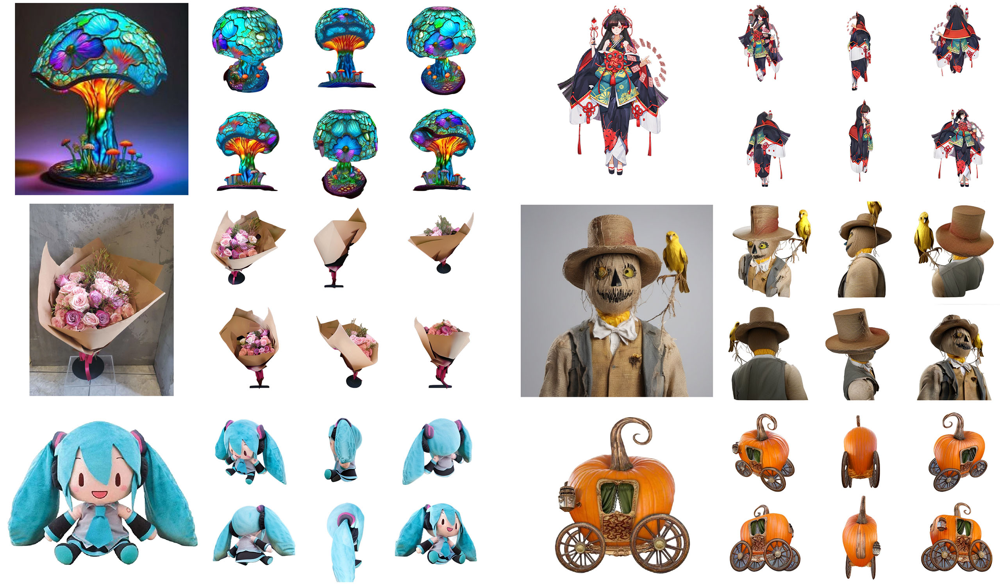

# Zero123++: a Single Image to Consistent Multi-view Diffusion Base Model



[Report](https://arxiv.org/abs/2310.15110) [Demo](https://huggingface.co/spaces/sudo-ai/zero123plus-demo-space)

## Get Started

You will need `torch` (recommended `2.0` or higher), `diffusers` (recommended `0.20.2`) and `transformers` to start. If you are using `torch` `1.x`, it is recommended to install `xformers` to compute attentions in the model efficiently. The code also runs on older versions of `diffusers`, but you may see a decrease in model performance.

And you are all set! We provide a custom pipeline for `diffusers` so no extra code is required.

To generate multi-view images from a single input image, you can run the following code (also see [examples/img_to_mv.py](examples/img_to_mv.py)):

```python
import torch
import requests
from PIL import Image
from diffusers import DiffusionPipeline, EulerAncestralDiscreteScheduler

# Load the pipeline
pipeline = DiffusionPipeline.from_pretrained(
    "sudo-ai/zero123plus-v1.1", custom_pipeline="sudo-ai/zero123plus-pipeline",
    torch_dtype=torch.float16
)

# Feel free to tune the scheduler!
# `timestep_spacing` parameter is not supported in older versions of `diffusers`
# so there may be performance degradations
# We recommend using `diffusers==0.20.2`
pipeline.scheduler = EulerAncestralDiscreteScheduler.from_config(
    pipeline.scheduler.config, timestep_spacing='trailing'
)
pipeline.to('cuda:0')

# Download an example image.
cond = Image.open(requests.get("https://d.skis.ltd/nrp/sample-data/lysol.png", stream=True).raw)

# Run the pipeline!
result = pipeline(cond, num_inference_steps=75).images[0]
# for general real and synthetic images of general objects
# usually it is enough to have around 28 inference steps
# for images with delicate details like faces (real or anime)
# you may need 75-100 steps for the details to construct

result.show()
result.save("output.png")
```

The above example requires ~5GB VRAM to operate.
The input image needs to be square, and the recommended image resolution is `>=320x320`.

By default, Zero123++ generates opaque images with gray background (the `zero` for Stable Diffusion VAE).
You may run an extra background removal pass like `rembg` to remove the gray background.

```python
# !pip install rembg
import rembg
result = rembg.remove(result)
result.show()
```

To run the depth ControlNet, you can use the following example (also see [examples/depth_controlnet.py](examples/depth_controlnet.py)):

```python
import torch
import requests
from PIL import Image
from diffusers import DiffusionPipeline, EulerAncestralDiscreteScheduler, ControlNetModel

# Load the pipeline
pipeline = DiffusionPipeline.from_pretrained(
    "sudo-ai/zero123plus-v1.1", custom_pipeline="sudo-ai/zero123plus-pipeline",
    torch_dtype=torch.float16
)
pipeline.add_controlnet(ControlNetModel.from_pretrained(
    "sudo-ai/controlnet-zp11-depth-v1", torch_dtype=torch.float16
), conditioning_scale=0.75)
# Feel free to tune the scheduler
pipeline.scheduler = EulerAncestralDiscreteScheduler.from_config(
    pipeline.scheduler.config, timestep_spacing='trailing'
)
pipeline.to('cuda:0')
# Run the pipeline
cond = Image.open(requests.get("https://d.skis.ltd/nrp/sample-data/0_cond.png", stream=True).raw)
depth = Image.open(requests.get("https://d.skis.ltd/nrp/sample-data/0_depth.png", stream=True).raw)
result = pipeline(cond, depth_image=depth, num_inference_steps=36).images[0]
result.show()
result.save("output.png")
```

This example requires ~5.7GB VRAM to operate.

## Models

The models are available at [https://huggingface.co/sudo-ai](https://huggingface.co/sudo-ai):

+ `sudo-ai/zero123plus-v1.1`, base Zero123++ model release (v1.1).
+ `sudo-ai/controlnet-zp11-depth-v1` depth ControlNet checkpoint release (v1) for Zero123++ (v1.1).

The source code for diffusers custom pipeline is available in the [diffusers-support](diffusers-support) directory.

## Running Demo Locally

You will need to install extra dependencies:
```
pip install -r requirements.txt
```

Then run `streamlit run app.py`.

## Citation

If you found Zero123++ helpful, please cite our report:
```bibtex
@misc{shi2023zero123,
      title={Zero123++: a Single Image to Consistent Multi-view Diffusion Base Model}, 
      author={Ruoxi Shi and Hansheng Chen and Zhuoyang Zhang and Minghua Liu and Chao Xu and Xinyue Wei and Linghao Chen and Chong Zeng and Hao Su},
      year={2023},
      eprint={2310.15110},
      archivePrefix={arXiv},
      primaryClass={cs.CV}
}
```
